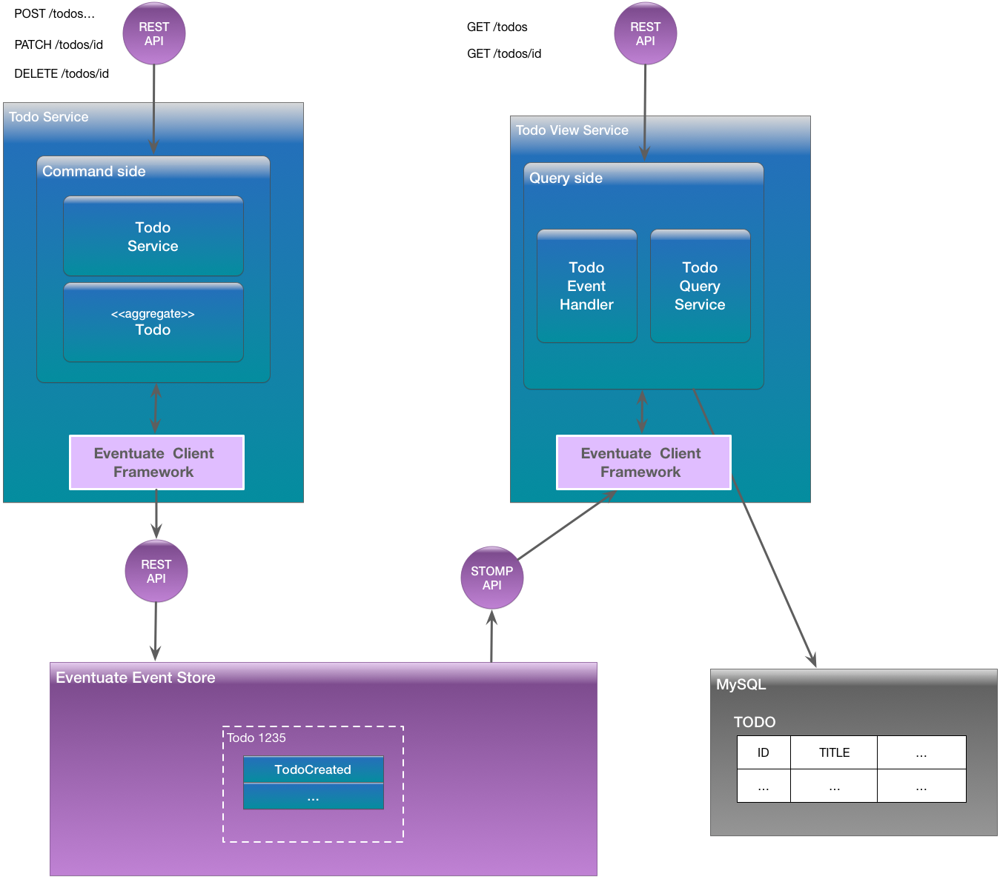

# Todo List example application

The Todo List application is the hello world application for the [Eventuate&trade; Platform](http://eventuate.io).
It illustrates how you can use the platform to write an application with a [microservices architecture](http://microservices.io/patterns/microservices.html) that uses [Event Sourcing](http://microservices.io/patterns/data/event-sourcing.html) and [Command Query Responsibility Segregation (CQRS)](http://microservices.io/patterns/data/cqrs.html).
The Todo List application lets users maintain a todo list.

The Todo List application is a Java and Spring Boot application built using Eventuate&trade;'s Event Sourcing based programming model.
Todos are implemented by an Event Sourcing-based `TodoAggregate`.
The aggregate's events are persisted in the Eventuate event store.
The application also maintains a materialized view of the data in MySQL.

Don't forget to take a look at the other [Eventuate example applications](http://eventuate.io/exampleapps.html).

# Got questions?

Don't hesitate to create an issue or see

* [Website](http://eventuate.io)
* [Mailing list](https://groups.google.com/d/forum/eventuate-users)
* [Slack](https://eventuate-users.slack.com). [Get invite](https://eventuateusersslack.herokuapp.com/)
* [Contact us](http://eventuate.io/contact.html).

# Architecture

The Todo application has a microservice architecture.
It is written using the [Eventuate Client Framework for Java](http://eventuate.io/docs/java/eventuate-client-framework-for-java.html), which provides an [event sourcing based programming model](http://eventuate.io/whyeventsourcing.html).
The following diagram shows the Todo List application architecture:



The application consists of the following:

* Todo service - a Java and Spring Boot-based service that has a HATEOAS-style REST API for creating, updating and querying todo list items.
It uses Eventuate to persist aggregates using event sourcing.
* Todo view service - a Java and Spring Boot-based service that provides a REST API for querying todos.
It implements a [Command Query Responsibility Segregation (CQRS)](http://microservices.io/patterns/data/cqrs.html) view of todos using MySQL.
MySQL is kept up to date by subscribing to events produced by the Todo service.
* MySQL database - stores the CQRS view of todo list items.

Note: for simplicity, the Todo list application can be deployed as a monolithic application.

# Two versions of the source code

There are two versions of the source code:

* `single-module` - a single module Gradle project for a monolithic version of the application.
It is the easiest to get started with.
* `multi-module` - a multi-module Gradle project for the microservices-based version of the application.

Note: you do not need to install Gradle since it will be downloaded automatically.
You just need to have Java 8 installed.

# Building and running the application

The steps for building both versions of the application are identical.
However, the details of how to build and run the services depend slightly on whether you are using Eventuate SaaS or Eventuate Local.

## Building and running using Eventuate SaaS

First, must [sign up to get your credentials](https://signup.eventuate.io/) in order to get free access to the SaaS version.

Next, build the application

```
./gradlew assemble
```

Next, you can launch the services using [Docker Compose](https://docs.docker.com/compose/):

```
docker-compose build
docker-compose up -d
```

## Building and running using Eventuate Local

First, build the application

```
./gradlew assemble -P eventuateDriver=local
```

Next, launch the services using [Docker Compose](https://docs.docker.com/compose/):

```
export DOCKER_HOST_IP=...
docker-compose -f docker-compose-eventuate-local.yml build
docker-compose -f docker-compose-eventuate-local.yml up -d
```

Note: You need to set `DOCKER_HOST_IP` before running Docker Compose.
This must be an IP address or resolvable hostname.
It cannot be `localhost`.
See this [guide to setting `DOCKER_HOST_IP`](http://eventuate.io/docs/usingdocker.html) for more information.

# Using the application

Once the application has started, you can use the application via the Swagger UI.

If you are running the `multi-module` version:

* `http://${DOCKER_HOST_IP}:8081/swagger-ui.html` - the command-side service
* `http://${DOCKER_HOST_IP}:8082/swagger-ui.html` - the query-side service

If you are running the `single-module` version:

* `http://${DOCKER_HOST_IP}:8080/swagger-ui.html` - the monolithic application

# Using the Eventuate Local console

You can also use the Eventuate Local console to view aggregates and watch the stream of events.
Visit the URL `http://${DOCKER_HOST_IP}:8085`

# Got questions?

Don't hesitate to create an issue or see

* [Website](http://eventuate.io)
* [Mailing list](https://groups.google.com/d/forum/eventuate-users)
* [Slack](https://eventuate-users.slack.com). [Get invite](https://eventuateusersslack.herokuapp.com/)
* [Contact us](http://eventuate.io/contact.html).
